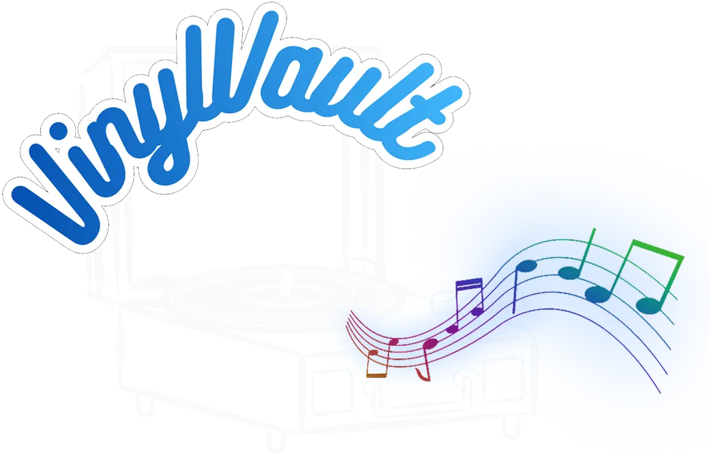

<h1 align="center">VinylVault - Il Tuo Archivio Personale del Vinile</h1>

  

**VinylVault** è una piattaforma web moderna e intuitiva progettata per gli appassionati di musica su supporto fisico. In un'era dominata dallo streaming, questo "caveau digitale" permette ai collezionisti di organizzare, catalogare e approfondire la propria libreria musicale in modo sistematico.

Link al sito: https://caa.studenti.math.unipd.it/dvigolo/index.php

---

## Obiettivi del Progetto
Il progetto risolve la complessità del collezionismo moderno, distinguendo tra diverse stampe e specifiche tecniche.
* **Accuratezza:** Distinzione tra varianti (es. "Blue Galaxy Edition" vs "Standard Black").
* **User Experience:** Interfaccia pulita capace di gestire grandi quantità di dati senza sovraccaricare l'utente.
* **Accessibilità:** Sviluppato seguendo le norme **WCAG 2.2 livello AA**, con supporto per screen reader e navigazione da tastiera.

---

## Funzionalità Core

### Per il Collezionista
* **Gestione Personale:** Sezioni **Collezione** (con valutazione personale a stelle) e **Lista dei Desideri** (con priorità d'acquisto in percentuale).
* **Esplorazione Dinamica:** "Album della Settimana", classifiche di tendenza e suggerimenti basati sulla community.
* **Ricerca Avanzata:** Catalogo con filtri per genere e anno di pubblicazione tramite slider cronologico.

### Per l'Amministratore
* **Gestione Contenuti:** Area protetta per l'inserimento di nuovi artisti, album, edizioni e tracce.

---

## Architettura Tecnica

<table>
  <thead>
    <tr>
      <th>Componente</th>
      <th>Dettagli Implementativi</th>
    </tr>
  </thead>
  <tbody>
    <tr>
      <td>Backend</td>
      <td>PHP con classe <code>Template</code> per separare logica e presentazione.</td>
    </tr>
    <tr>
      <td>Frontend</td>
      <td>HTML5 semantico, CSS3 Mobile-First e supporto nativo Dark Mode.</td>
    </tr>
    <tr>
      <td>Database</td>
      <td>MySQL con pattern Singleton e gestione tramite transazioni.</td>
    </tr>
    <tr>
      <td>Sicurezza</td>
      <td>Prepared Statements, sanitizzazione input e protezione tramite <code>.htaccess</code>.</td>
    </tr>
  </tbody>
</table>

### Design System
* **Tipografia:** `Lexend` per massimizzare la leggibilità e `Alegreya SC Sans` per l'eleganza dei titoli.
* **Palette:** Azzurro polvere e blu notte, con contrasti ottimizzati (4.5:1) per l'accessibilità.

---

## Team di Sviluppo
* **De Fina Giuseppe:** Catalogo, Esplora, logica di query e raccomandazioni.
* **Mantoan Matteo:** Schema DB, autenticazione, validazione e accessibilità.
* **Salvalaio Siria:** Design UI/UX (Figma), CSS Responsive e ottimizzazione HTML.
* **Vigolo Davide:** Architettura codice, gestione repository, pagine admin e core UI.

---

## Setup e Test
Il progetto utilizza **Docker Compose** per garantire la coerenza dell'ambiente di sviluppo.

1. **Credenziali di Test:**
   - **User:** `user` / `user`
   - **Admin:** `admin` / `admin`
2. **Validazione:** Pagine verificate con *Total Validator* (HTML5, WCAG 2.2 AA).

---

  Progetto universitario per il corso di <b>Tecnologie Web</b> 
  AA. 2025/2026
  Università degli Studi di Padova 

